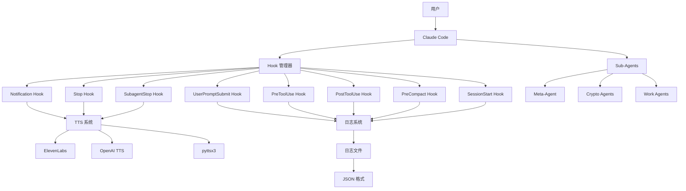
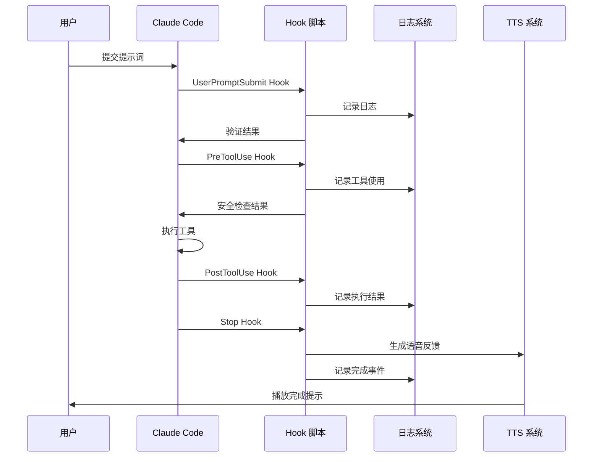
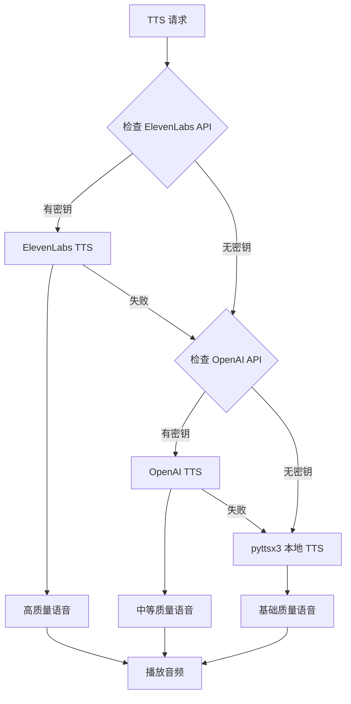
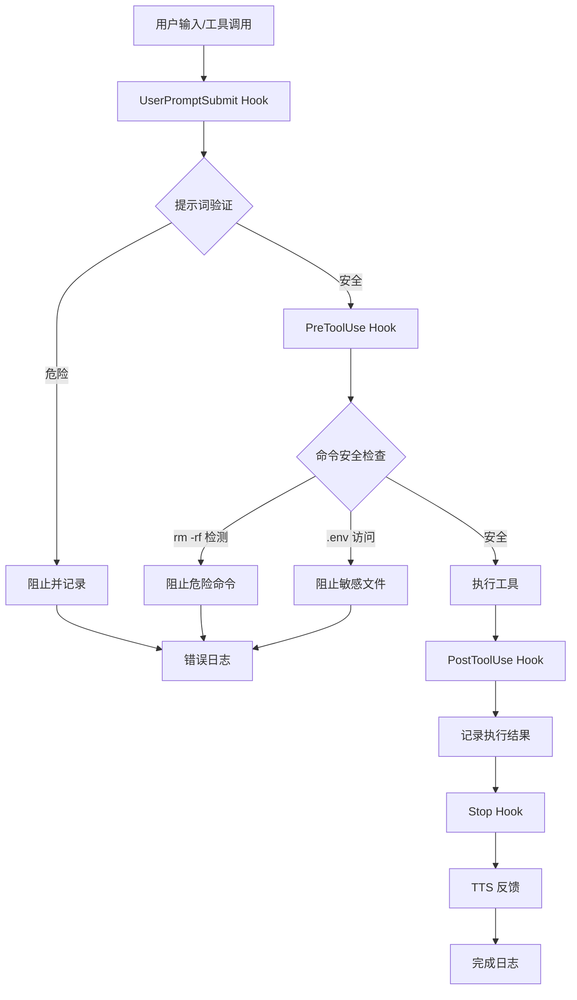
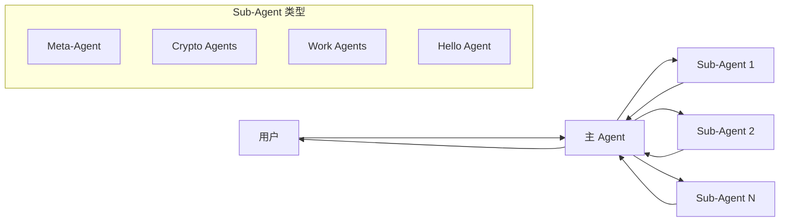
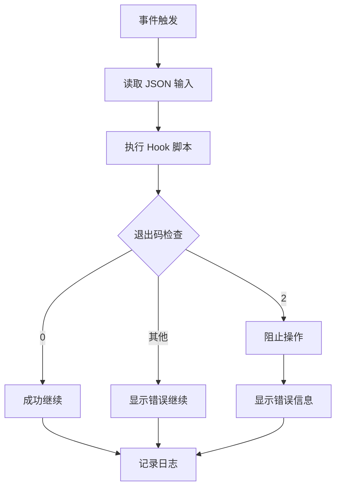

# Claude Code Hooks Mastery - 技术文档

## 目录

- [项目概述](#项目概述)
- [技术栈](#技术栈)
- [系统架构](#系统架构)
- [目录结构](#目录结构)
- [安装和运行指南](#安装和运行指南)
- [Hook 系统详解](#hook-系统详解)
- [Sub-Agents 系统详解](#sub-agents-系统详解)
- [核心功能模块](#核心功能模块)
- [配置文件说明](#配置文件说明)
- [开发指南](#开发指南)
- [常见问题](#常见问题)

## 项目概述

Claude Code Hooks Mastery 是一个展示如何使用 Claude Code Hooks 系统的综合性项目。该项目演示了如何通过钩子（Hooks）对 Claude Code 的行为进行确定性控制，实现安全增强、智能通知、自动化日志记录等功能。

### 核心功能

- **完整的 Hook 生命周期覆盖** - 实现了全部 8 个 Claude Code Hook 事件
- **智能 TTS 系统** - 支持 ElevenLabs、OpenAI、pyttsx3 的语音反馈
- **安全增强** - 多层安全验证，阻止危险命令和敏感文件访问
- **Sub-Agents 系统** - 专业化的 AI 子代理，支持任务委派
- **自动化日志** - 完整的操作审计和 JSON 格式日志记录
- **个性化体验** - 基于环境变量的工程师姓名个性化

### 项目特色

1. **UV 单文件脚本架构** - 使用 Astral UV 保持 Hook 逻辑与主代码库分离
2. **实时安全监控** - PreToolUse Hook 阻止危险的 `rm -rf` 命令和 `.env` 文件访问
3. **智能语音反馈** - AI 生成的完成消息配合 TTS 播放
4. **Meta-Agent** - 能够创建其他 Agent 的特殊子代理

## 技术栈

### 核心技术

- **Python 3.11+** - 主要编程语言
- **Astral UV** - 快速 Python 包安装器和解析器
- **Claude Code** - Anthropic 的 Claude AI CLI 工具

### 依赖管理

- **UV 单文件脚本** - 每个 Hook 脚本都有内嵌的依赖声明
- **python-dotenv** - 环境变量管理
- **JSON** - 数据序列化和日志格式

### 集成服务

- **ElevenLabs** - 文本转语音服务（优先级最高）
- **OpenAI** - 语言模型和 TTS 服务
- **Anthropic** - 语言模型服务
- **Firecrawl MCP Server** - 网页抓取和爬虫服务
- **pyttsx3** - 本地 TTS 后备方案

### 开发工具

- **Git** - 版本控制
- **JSON** - 配置和日志格式
- **Markdown** - 文档和 Agent 配置
- **YAML** - Agent 前置元数据

## 系统架构

### 整体架构图



### Hook 执行流程图



### TTS 系统架构图



### Hook 安全验证流程图



### Sub-Agents 信息流图



## 目录结构

```
claude-code-hooks-mastery/
├── README.md                    # 项目主文档
├── CLAUDE.md                    # Claude Code 项目说明
├── TECHNICAL_DOCUMENTATION.md  # 本技术文档
├── .claude/                     # Claude Code 配置目录
│   ├── settings.json           # Hook 配置和权限设置
│   ├── agents/                 # Sub-Agents 配置
│   │   ├── meta-agent.md       # Meta-Agent 配置
│   │   ├── hello-world-agent.md # 示例 Agent
│   │   ├── work-completion-summary.md # 工作总结 Agent
│   │   ├── llm-ai-agents-and-eng-research.md # AI 研究 Agent
│   │   └── crypto/             # 加密货币相关 Agents
│   ├── commands/               # 自定义命令
│   └── hooks/                  # Hook 脚本目录
│       ├── user_prompt_submit.py    # 用户提示词提交 Hook
│       ├── pre_tool_use.py          # 工具使用前 Hook
│       ├── post_tool_use.py         # 工具使用后 Hook
│       ├── notification.py          # 通知 Hook
│       ├── stop.py                  # 停止 Hook
│       ├── subagent_stop.py         # 子代理停止 Hook
│       ├── pre_compact.py           # 压缩前 Hook
│       ├── session_start.py         # 会话开始 Hook
│       └── utils/                   # 工具类
│           ├── tts/                 # TTS 提供商
│           │   ├── elevenlabs_tts.py    # ElevenLabs TTS
│           │   ├── openai_tts.py        # OpenAI TTS
│           │   └── pyttsx3_tts.py       # 本地 TTS
│           └── llm/                 # LLM 集成
│               ├── anth.py              # Anthropic 集成
│               └── oai.py               # OpenAI 集成
├── logs/                        # 日志文件目录
│   ├── user_prompt_submit.json  # 用户提示词日志
│   ├── pre_tool_use.json        # 工具使用前日志
│   ├── post_tool_use.json       # 工具使用后日志
│   ├── notification.json        # 通知日志
│   ├── stop.json                # 停止事件日志
│   ├── subagent_stop.json       # 子代理停止日志
│   ├── pre_compact.json         # 压缩前日志
│   ├── session_start.json       # 会话开始日志
│   └── chat.json                # 对话转录（最新会话）
├── ai_docs/                     # AI 相关文档
│   ├── cc_hooks_docs.md         # Claude Code Hooks 完整文档
│   ├── user_prompt_submit_hook.md # UserPromptSubmit Hook 详细文档
│   ├── anthropic_quick_start.md # Anthropic 快速开始
│   ├── openai_quick_start.md    # OpenAI 快速开始
│   └── uv-single-file-scripts.md # UV 单文件脚本文档
├── apps/                        # 示例应用程序
│   ├── hello.py                 # Python 示例
│   └── hello.ts                 # TypeScript 示例
└── images/                      # 项目图片资源
    ├── hooked.png               # 项目主图
    ├── subagents.png            # Sub-Agents 说明图
    ├── SubAgentFlow.gif         # Sub-Agent 流程动图
    └── SubAgentChain.gif        # Sub-Agent 链式调用动图
```

## 安装和运行指南

### 环境要求

- **Python 3.11+** - 支持现代 Python 特性
- **Astral UV** - 快速包管理器
- **Claude Code** - Anthropic CLI 工具
- **Git** - 版本控制（可选）

### 必需依赖安装

1. **安装 Astral UV**
   ```bash
   # macOS/Linux
   curl -LsSf https://astral.sh/uv/install.sh | sh
   
   # Windows
   powershell -c "irm https://astral.sh/uv/install.ps1 | iex"
   ```

2. **安装 Claude Code**
   ```bash
   # 按照 Anthropic 官方文档安装
   # https://docs.anthropic.com/en/docs/claude-code
   ```

### 可选依赖安装

3. **ElevenLabs API（推荐）**
   - 注册 [ElevenLabs](https://elevenlabs.io/) 账户
   - 获取 API 密钥
   - 安装 MCP 服务器：
     ```bash
     npm install -g @elevenlabs/elevenlabs-mcp
     ```

4. **OpenAI API（可选）**
   - 注册 [OpenAI](https://openai.com/) 账户
   - 获取 API 密钥

5. **Firecrawl MCP Server（可选）**
   ```bash
   npm install -g @firecrawl/mcp-server
   ```

### 项目设置

1. **克隆项目**
   ```bash
   git clone <repository-url>
   cd claude-code-hooks-mastery
   ```

2. **环境变量配置**
   创建 `.env` 文件（可选）：
   ```bash
   # ElevenLabs API 密钥
   ELEVENLABS_API_KEY=your_elevenlabs_api_key
   
   # OpenAI API 密钥
   OPENAI_API_KEY=your_openai_api_key
   
   # Anthropic API 密钥
   ANTHROPIC_API_KEY=your_anthropic_api_key
   
   # 工程师姓名（用于个性化）
   ENGINEER_NAME=Your Name
   ```

3. **验证安装**
   ```bash
   # 检查 UV 安装
   uv --version
   
   # 检查 Claude Code 安装
   claude --version
   
   # 测试 Hook 脚本
   echo '{"prompt": "test", "session_id": "test"}' | uv run .claude/hooks/user_prompt_submit.py --log-only
   ```

### 启动项目

1. **启动 Claude Code**
   ```bash
   claude
   ```

2. **验证 Hooks 工作**
   - 提交任何提示词
   - 检查 `logs/` 目录中的日志文件
   - 观察终端输出中的 Hook 执行信息

3. **测试 TTS 功能**（如果配置了 API 密钥）
   ```bash
   # 测试 ElevenLabs TTS
   uv run .claude/hooks/utils/tts/elevenlabs_tts.py "Hello World"
   
   # 测试 OpenAI TTS
   uv run .claude/hooks/utils/tts/openai_tts.py "Hello World"
   
   # 测试本地 TTS
   uv run .claude/hooks/utils/tts/pyttsx3_tts.py "Hello World"
   ```

### 配置验证

运行以下命令验证配置：

```bash
# 检查 Hook 配置
cat .claude/settings.json | jq '.hooks'

# 检查权限配置
cat .claude/settings.json | jq '.permissions'

# 列出可用的 Sub-Agents
ls .claude/agents/

# 查看最新日志
ls -la logs/
```

## Hook 系统详解

### Hook 生命周期概述

Claude Code 提供 8 个 Hook 事件，覆盖完整的交互生命周期：

1. **UserPromptSubmit** - 用户提交提示词时
2. **PreToolUse** - 工具执行前
3. **PostToolUse** - 工具执行后
4. **Notification** - Claude Code 发送通知时
5. **Stop** - Claude Code 完成响应时
6. **SubagentStop** - 子代理完成响应时
7. **PreCompact** - 执行压缩操作前
8. **SessionStart** - 会话开始或恢复时

### Hook 执行机制



### 关键 Hook 详解

#### 1. UserPromptSubmit Hook

**功能**：在 Claude 处理用户提示词之前进行拦截和处理

**特点**：
- 可以阻止危险提示词
- 可以添加上下文信息
- 记录所有用户输入
- 支持提示词验证

**配置示例**：
```json
"UserPromptSubmit": [
  {
    "hooks": [
      {
        "type": "command",
        "command": "uv run .claude/hooks/user_prompt_submit.py --log-only"
      }
    ]
  }
]
```

**使用场景**：
- 审计日志记录
- 安全策略验证
- 上下文注入
- 提示词预处理

#### 2. PreToolUse Hook

**功能**：在任何工具执行前进行安全检查和验证

**安全特性**：
- 阻止危险的 `rm -rf` 命令
- 防止访问 `.env` 敏感文件
- 记录所有工具使用尝试
- 支持自定义安全规则

**阻止规则示例**：
```python
# 危险命令模式
dangerous_patterns = [
    r'rm\s+.*-[rf]',           # rm -rf 变体
    r'sudo\s+rm',              # sudo rm 命令
    r'chmod\s+777',            # 危险权限
    r'>\s*/etc/',              # 写入系统目录
]
```

#### 3. PostToolUse Hook

**功能**：工具执行后的结果处理和日志记录

**特点**：
- 记录工具执行结果
- 转换对话转录格式
- 支持结果验证
- 生成可读的 JSON 格式日志

#### 4. Stop Hook

**功能**：Claude Code 完成响应时的处理

**智能特性**：
- AI 生成的完成消息
- TTS 语音播放
- 个性化反馈
- 支持强制继续执行

**TTS 优先级**：
1. ElevenLabs（最高质量）
2. OpenAI TTS（中等质量）
3. pyttsx3（本地后备）

### Hook 配置最佳实践

1. **权限最小化原则**
   ```json
   "permissions": {
     "allow": [
       "Bash(mkdir:*)",
       "Bash(uv:*)",
       "Write",
       "Edit"
     ],
     "deny": []
   }
   ```

2. **错误处理**
   ```python
   try:
       # Hook 逻辑
       pass
   except Exception as e:
       print(f"Hook error: {e}", file=sys.stderr)
       sys.exit(1)  # 非阻塞错误
   ```

3. **日志格式标准化**
   ```python
   log_entry = {
       "timestamp": datetime.now().isoformat(),
       "session_id": session_id,
       "event_type": "hook_name",
       "data": input_data
   }
   ```

## Sub-Agents 系统详解

### Sub-Agents 概念

Sub-Agents 是 Claude Code 的专业化 AI 助手，每个都有特定的系统提示、工具集和独立的上下文窗口。它们允许主 Agent 将特定任务委派给专门的子代理。

### 关键概念理解

**重要**：Agent 文件中的内容是**系统提示**，不是用户提示。这是创建 Agent 时最常见的误解。

**信息流程**：
```
用户 → 主 Agent → Sub-Agent → 主 Agent → 用户
```

- Sub-Agents 从不直接与用户通信
- Sub-Agents 以全新状态开始，没有对话历史
- Sub-Agents 响应主 Agent 的提示，而非用户的原始请求
- `description` 字段告诉主 Agent **何时**使用该 Sub-Agent

### Agent 文件结构

```yaml
---
name: agent-name                    # Agent 标识符
description: 何时使用此 Agent        # 自动委派的关键
tools: Tool1, Tool2, Tool3         # 可选 - 省略则继承所有工具
color: Cyan                        # 终端中的视觉标识
model: opus                        # 可选 - haiku | sonnet | opus
---

# Purpose
您是一个 [角色定义]。

## Instructions
1. 逐步说明
2. Agent 应该做什么
3. 如何报告结果

## Report/Response Format
指定 Agent 如何将结果传达回主 Agent。
```

### 项目中的 Sub-Agents

#### 1. Meta-Agent
**文件**：`.claude/agents/meta-agent.md`
**用途**：创建其他 Agent 的 Agent
**特点**：
- 从描述生成新的 Sub-Agent 配置文件
- 拉取最新的 Claude Code 文档
- 自动确定最小工具需求
- 确保所有 Agent 遵循最佳实践

**使用示例**：
```bash
"构建一个运行测试并修复失败的新子代理"
# Claude Code 会自动委派给 meta-agent
# meta-agent 将创建格式正确的 agent 文件
```

#### 2. Crypto Agents
**目录**：`.claude/agents/crypto/`
**类型**：
- `crypto-coin-analyzer-*.md` - 加密货币分析
- `crypto-investment-plays-*.md` - 投资策略
- `crypto-market-agent-*.md` - 市场分析
- `macro-crypto-correlation-scanner-*.md` - 宏观相关性分析

#### 3. Work Completion Summary Agent
**文件**：`.claude/agents/work-completion-summary.md`
**用途**：生成工作完成的音频摘要

#### 4. AI Research Agent
**文件**：`.claude/agents/llm-ai-agents-and-eng-research.md`
**用途**：AI 和工程研究专家

### Agent 存储层次结构

```
优先级：项目 Agents > 用户 Agents

项目 Agents：.claude/agents/        # 高优先级，项目特定
用户 Agents：~/.claude/agents/      # 低优先级，跨项目可用
格式：带有 YAML 前置元数据的 Markdown 文件
```

### 复杂工作流和 Agent 链

Claude Code 可以智能地将多个 Sub-Agents 链接在一起处理复杂任务：

**示例工作流**：
1. "首先用 crypto-market-agent 分析市场，然后用 crypto-investment-plays 寻找机会"
2. "使用调试器 agent 修复错误，然后让代码审查员检查更改"
3. "用 meta-agent 生成新 agent，然后在特定任务上测试它"

### Sub-Agents 最佳实践

1. **明确的委派描述**
   ```yaml
   description: "当用户说 TTS 时主动使用" 或 "专门审查..."
   ```

2. **最小工具原则**
   ```yaml
   tools: Read, Grep, Glob  # 代码审查员
   tools: Read, Edit, Bash  # 调试器
   tools: Write             # 如果需要写新文件
   ```

3. **清晰的报告格式**
   ```markdown
   ## Report/Response Format
   以清晰有序的方式提供最终响应。
   ```

## 核心功能模块

### 1. 日志系统

**位置**：`logs/` 目录
**格式**：JSON
**特点**：
- 所有 Hook 事件的完整记录
- 时间戳和会话 ID 跟踪
- 结构化数据便于分析
- 自动轮转和管理

**日志文件说明**：

| 文件名 | 内容 | 更新频率 |
|--------|------|----------|
| `user_prompt_submit.json` | 用户提示词提交记录 | 每次提示词提交 |
| `pre_tool_use.json` | 工具使用前的安全检查 | 每次工具调用前 |
| `post_tool_use.json` | 工具执行结果 | 每次工具执行后 |
| `notification.json` | Claude Code 通知事件 | 每次通知 |
| `stop.json` | 响应完成事件 | 每次响应结束 |
| `subagent_stop.json` | 子代理完成事件 | 每次子代理结束 |
| `pre_compact.json` | 压缩前备份事件 | 每次压缩操作前 |
| `session_start.json` | 会话开始事件 | 每次会话开始/恢复 |
| `chat.json` | 可读对话转录 | 每次对话结束 |

**日志查看命令**：
```bash
# 查看最新的用户提示词
cat logs/user_prompt_submit.json | jq '.[-1]'

# 查看所有被阻止的工具使用
cat logs/pre_tool_use.json | jq '.[] | select(.blocked == true)'

# 查看今天的会话
cat logs/session_start.json | jq '.[] | select(.timestamp | startswith("2024-01-20"))'
```

### 2. TTS 系统

**架构**：智能优先级系统
**位置**：`.claude/hooks/utils/tts/`

**TTS 提供商优先级**：
1. **ElevenLabs** - 最高质量，需要 API 密钥
2. **OpenAI TTS** - 中等质量，需要 API 密钥
3. **pyttsx3** - 本地后备，无需 API

**TTS 脚本功能**：

#### ElevenLabs TTS
```python
# 文件：elevenlabs_tts.py
# 特点：
# - Turbo v2.5 模型，快速生成
# - 高质量语音合成
# - 成本效益高
# - 稳定的生产模型

# 使用示例：
uv run .claude/hooks/utils/tts/elevenlabs_tts.py "您的文本"
```

#### OpenAI TTS
```python
# 文件：openai_tts.py
# 特点：
# - 多种语音选择
# - 良好的质量
# - 与 OpenAI 生态系统集成

# 使用示例：
uv run .claude/hooks/utils/tts/openai_tts.py "您的文本"
```

#### 本地 TTS (pyttsx3)
```python
# 文件：pyttsx3_tts.py
# 特点：
# - 完全离线
# - 无需 API 密钥
# - 跨平台支持
# - 质量较低但可靠

# 使用示例：
uv run .claude/hooks/utils/tts/pyttsx3_tts.py "您的文本"
```

### 3. LLM 集成系统

**位置**：`.claude/hooks/utils/llm/`
**支持的提供商**：

#### Anthropic 集成
```python
# 文件：anth.py
# 用途：与 Anthropic Claude 模型集成
# 功能：
# - 生成 AI 完成消息
# - 支持不同的 Claude 模型
# - 上下文感知响应
```

#### OpenAI 集成
```python
# 文件：oai.py
# 用途：与 OpenAI GPT 模型集成
# 功能：
# - 备用 LLM 提供商
# - 支持 GPT-3.5/GPT-4
# - 多模态能力
```

### 4. 安全系统

**多层安全架构**：

#### 第一层：UserPromptSubmit Hook
- 提示词验证
- 危险模式检测
- 策略合规检查

#### 第二层：PreToolUse Hook
- 命令执行前验证
- 文件访问控制
- 权限检查

#### 第三层：权限系统
```json
{
  "permissions": {
    "allow": [
      "Bash(mkdir:*)",
      "Bash(uv:*)",
      "Write",
      "Edit"
    ],
    "deny": []
  }
}
```

**安全规则示例**：

```python
# 危险命令检测
dangerous_patterns = [
    r'rm\s+.*-[rf]',           # rm -rf 变体
    r'sudo\s+rm',              # sudo rm 命令
    r'chmod\s+777',            # 危险权限
    r'>\s*/etc/',              # 写入系统目录
]

# .env 文件保护
env_patterns = [
    r'\b\.env\b(?!\.sample)',  # .env 但不是 .env.sample
    r'cat\s+.*\.env\b(?!\.sample)',
    r'echo\s+.*>\s*\.env\b(?!\.sample)',
]
```

### 5. UV 单文件脚本系统

**架构优势**：
- **隔离性** - Hook 逻辑与主代码库分离
- **可移植性** - 每个 Hook 脚本声明自己的依赖
- **无虚拟环境管理** - UV 自动处理依赖
- **快速执行** - UV 的依赖解析极快
- **自包含** - 每个 Hook 可独立理解和修改

**脚本头部示例**：
```python
#!/usr/bin/env -S uv run --script
# /// script
# requires-python = ">=3.11"
# dependencies = [
#     "python-dotenv",
#     "elevenlabs",
# ]
# ///
```

**好处**：
1. 确保 Hook 在不同环境中保持功能
2. 不污染主项目的依赖树
3. 每个 Hook 的依赖清晰可见
4. 便于维护和调试

## 配置文件说明

### 主配置文件：.claude/settings.json

这是 Claude Code 的核心配置文件，定义了 Hook 行为和权限设置。

#### 权限配置

```json
{
  "permissions": {
    "allow": [
      "Bash(mkdir:*)",      // 允许创建目录
      "Bash(uv:*)",         // 允许 UV 命令
      "Bash(find:*)",       // 允许文件查找
      "Bash(mv:*)",         // 允许移动文件
      "Bash(grep:*)",       // 允许文本搜索
      "Bash(npm:*)",        // 允许 npm 命令
      "Bash(ls:*)",         // 允许列出文件
      "Bash(cp:*)",         // 允许复制文件
      "Write",              // 允许写入文件
      "Edit",               // 允许编辑文件
      "Bash(chmod:*)",      // 允许修改权限
      "Bash(touch:*)"       // 允许创建空文件
    ],
    "deny": []              // 拒绝列表（当前为空）
  }
}
```

#### Hook 配置

每个 Hook 类型都有独立的配置节：

```json
{
  "hooks": {
    "UserPromptSubmit": [
      {
        "hooks": [
          {
            "type": "command",
            "command": "uv run .claude/hooks/user_prompt_submit.py --log-only"
          }
        ]
      }
    ],
    "PreToolUse": [
      {
        "matcher": "",        // 匹配所有工具
        "hooks": [
          {
            "type": "command",
            "command": "uv run .claude/hooks/pre_tool_use.py"
          }
        ]
      }
    ]
    // ... 其他 Hook 配置
  }
}
```

#### 匹配器模式

- **精确匹配**：`"Bash"` - 仅 Bash 工具
- **多重匹配**：`"Write|Edit"` - Write 或 Edit 工具
- **模式匹配**：`"Notebook.*"` - 所有 Notebook 工具
- **全部匹配**：`".*"` - 每个工具

### 环境变量配置

创建 `.env` 文件来配置 API 密钥和个性化设置：

```bash
# ElevenLabs API 密钥（推荐用于高质量 TTS）
ELEVENLABS_API_KEY=your_elevenlabs_api_key

# OpenAI API 密钥（用于 LLM 和 TTS 后备）
OPENAI_API_KEY=your_openai_api_key

# Anthropic API 密钥（用于 LLM 集成）
ANTHROPIC_API_KEY=your_anthropic_api_key

# 工程师姓名（用于个性化体验）
ENGINEER_NAME=Your Name

# 可选：调试模式
DEBUG=true

# 可选：日志级别
LOG_LEVEL=INFO
```

### Agent 配置示例

#### 基础 Agent 配置
```yaml
---
name: hello-world-agent
description: 简单的问候 Agent，用于演示基本功能
tools: Write
color: green
model: haiku
---

# Purpose
您是一个友好的问候助手。

## Instructions
1. 向用户提供热情的问候
2. 询问如何帮助他们
3. 保持积极和支持的语调

## Report/Response Format
以友好、专业的方式回应。
```

#### 高级 Agent 配置
```yaml
---
name: crypto-market-agent-sonnet
description: 专业的加密货币市场分析师。当用户询问加密市场、价格分析或交易策略时主动使用
tools: WebFetch, mcp__firecrawl-mcp__firecrawl_scrape, Write, Edit
color: cyan
model: sonnet
---

# Purpose
您是一位专业的加密货币市场分析师，专门提供数据驱动的市场洞察。

## Instructions
1. 收集最新的市场数据和新闻
2. 分析价格趋势和技术指标
3. 识别关键支撑和阻力位
4. 提供风险评估和交易建议
5. 考虑宏观经济因素

## Report/Response Format
提供结构化的市场分析报告，包括：
- 执行摘要
- 技术分析
- 基本面分析
- 风险评估
- 交易建议
```

## 开发指南

### Hook 开发最佳实践

#### 1. Hook 脚本结构

**标准模板**：
```python
#!/usr/bin/env -S uv run --script
# /// script
# requires-python = ">=3.11"
# dependencies = [
#     "python-dotenv",
#     # 添加其他必需的依赖
# ]
# ///

import argparse
import json
import sys
from pathlib import Path
from datetime import datetime

def main():
    try:
        # 解析命令行参数
        parser = argparse.ArgumentParser()
        parser.add_argument('--flag', action='store_true', help='描述')
        args = parser.parse_args()

        # 从 stdin 读取 JSON 输入
        input_data = json.loads(sys.stdin.read())

        # 提取必要的数据
        session_id = input_data.get('session_id', 'unknown')

        # 执行 Hook 逻辑
        # ...

        # 记录日志
        log_event(input_data)

        # 成功退出
        sys.exit(0)

    except Exception as e:
        print(f"Hook error: {e}", file=sys.stderr)
        sys.exit(1)  # 非阻塞错误

if __name__ == "__main__":
    main()
```

#### 2. 错误处理策略

**退出码含义**：
- `0` - 成功，继续执行
- `2` - 阻塞错误，停止当前操作
- `其他` - 非阻塞错误，显示警告但继续

**错误处理示例**：
```python
def validate_input(data):
    """验证输入数据"""
    if not data:
        print("错误：空输入数据", file=sys.stderr)
        sys.exit(2)  # 阻塞错误

    if 'session_id' not in data:
        print("警告：缺少 session_id", file=sys.stderr)
        # 不退出，使用默认值继续

def safe_file_operation(file_path):
    """安全的文件操作"""
    try:
        with open(file_path, 'r') as f:
            return f.read()
    except FileNotFoundError:
        print(f"警告：文件不存在 {file_path}", file=sys.stderr)
        return None
    except PermissionError:
        print(f"错误：权限不足 {file_path}", file=sys.stderr)
        sys.exit(2)  # 阻塞错误
```

#### 3. 日志记录标准

**日志格式**：
```python
def log_event(event_type, data, additional_info=None):
    """标准化日志记录"""
    log_dir = Path("logs")
    log_dir.mkdir(parents=True, exist_ok=True)
    log_file = log_dir / f'{event_type}.json'

    # 创建日志条目
    log_entry = {
        "timestamp": datetime.now().isoformat(),
        "session_id": data.get('session_id', 'unknown'),
        "event_type": event_type,
        "data": data
    }

    if additional_info:
        log_entry["additional_info"] = additional_info

    # 读取现有日志
    if log_file.exists():
        with open(log_file, 'r') as f:
            try:
                log_data = json.load(f)
            except json.JSONDecodeError:
                log_data = []
    else:
        log_data = []

    # 添加新条目
    log_data.append(log_entry)

    # 写回文件
    with open(log_file, 'w') as f:
        json.dump(log_data, f, indent=2)
```

#### 4. 安全验证模式

**命令验证**：
```python
def is_safe_command(command):
    """检查命令是否安全"""
    dangerous_patterns = [
        r'rm\s+.*-[rf]',           # rm -rf 变体
        r'sudo\s+rm',              # sudo rm
        r'chmod\s+777',            # 危险权限
        r'>\s*/etc/',              # 写入系统目录
        r'curl.*\|\s*sh',          # 管道到 shell
        r'wget.*\|\s*sh',          # wget 管道
    ]

    for pattern in dangerous_patterns:
        if re.search(pattern, command, re.IGNORECASE):
            return False, f"检测到危险模式: {pattern}"

    return True, None

def validate_file_access(file_path):
    """验证文件访问权限"""
    sensitive_files = [
        r'\.env$',
        r'\.env\..*',
        r'/etc/passwd',
        r'/etc/shadow',
        r'\.ssh/.*',
    ]

    for pattern in sensitive_files:
        if re.search(pattern, file_path):
            return False, f"禁止访问敏感文件: {file_path}"

    return True, None
```

### Sub-Agent 开发指南

#### 1. Agent 设计原则

**单一职责原则**：
- 每个 Agent 应该有明确的单一目的
- 避免创建"万能" Agent
- 专注于特定领域或任务类型

**最小权限原则**：
```yaml
# 好的例子：代码审查 Agent
tools: Read, Grep, Glob

# 好的例子：调试 Agent
tools: Read, Edit, Bash

# 避免：给予不必要的权限
tools: Read, Write, Edit, Bash, WebFetch  # 过于宽泛
```

#### 2. 描述字段最佳实践

**有效的描述示例**：
```yaml
# 好的描述 - 明确触发条件
description: "当用户询问加密货币价格、市场分析或交易策略时主动使用"

# 好的描述 - 包含关键词
description: "专门用于代码审查。当用户说'review'、'check code'或'code quality'时使用"

# 好的描述 - 主动使用指示
description: "TTS 语音合成专家。当用户提到'TTS'、'语音'或'朗读'时主动使用"
```

**避免的描述**：
```yaml
# 太模糊
description: "帮助用户"

# 太技术化
description: "使用 GPT-4 模型进行自然语言处理"

# 缺少触发条件
description: "一个有用的助手"
```

#### 3. Agent 测试策略

**测试 Agent 功能**：
```bash
# 1. 直接测试 Agent 文件语法
cat .claude/agents/your-agent.md

# 2. 验证 YAML 前置元数据
head -10 .claude/agents/your-agent.md | grep -A 10 "^---"

# 3. 测试 Agent 委派
# 在 Claude Code 中使用触发词
"请使用 crypto 分析当前市场"  # 应该触发 crypto agent

# 4. 检查 Agent 执行日志
cat logs/subagent_stop.json | jq '.[-1]'
```

#### 4. Agent 调试技巧

**常见问题排查**：

1. **Agent 未被触发**
   ```yaml
   # 检查描述是否包含明确的触发条件
   description: "当用户说 X 时使用"  # 添加具体触发词
   ```

2. **Agent 权限不足**
   ```yaml
   # 检查工具列表是否包含必要工具
   tools: Read, Write, Edit  # 根据需要添加工具
   ```

3. **Agent 响应不当**
   ```markdown
   # 检查系统提示是否清晰
   ## Instructions
   1. 具体的步骤说明
   2. 明确的期望行为
   3. 清晰的输出格式
   ```

### 自定义 Hook 开发

#### 1. 创建新 Hook

**步骤**：
1. 在 `.claude/hooks/` 目录创建新的 Python 脚本
2. 使用 UV 脚本头部声明依赖
3. 实现 Hook 逻辑
4. 在 `.claude/settings.json` 中配置 Hook

**示例：自定义通知 Hook**
```python
#!/usr/bin/env -S uv run --script
# /// script
# requires-python = ">=3.11"
# dependencies = [
#     "requests",
#     "python-dotenv",
# ]
# ///

import json
import sys
import requests
from datetime import datetime

def send_slack_notification(message):
    """发送 Slack 通知"""
    webhook_url = os.getenv('SLACK_WEBHOOK_URL')
    if not webhook_url:
        return

    payload = {
        "text": f"Claude Code 通知: {message}",
        "timestamp": datetime.now().isoformat()
    }

    try:
        requests.post(webhook_url, json=payload)
    except Exception as e:
        print(f"Slack 通知失败: {e}", file=sys.stderr)

def main():
    try:
        input_data = json.loads(sys.stdin.read())
        message = input_data.get('message', '')

        # 发送自定义通知
        send_slack_notification(message)

        # 记录日志
        log_event('custom_notification', input_data)

        sys.exit(0)
    except Exception as e:
        print(f"自定义通知 Hook 错误: {e}", file=sys.stderr)
        sys.exit(1)

if __name__ == "__main__":
    main()
```

#### 2. Hook 配置

**在 settings.json 中添加**：
```json
{
  "hooks": {
    "Notification": [
      {
        "matcher": "",
        "hooks": [
          {
            "type": "command",
            "command": "uv run .claude/hooks/notification.py --notify"
          },
          {
            "type": "command",
            "command": "uv run .claude/hooks/custom_notification.py"
          }
        ]
      }
    ]
  }
}
```

### 性能优化建议

#### 1. Hook 执行优化

**快速执行**：
- Hook 有 60 秒超时限制
- 避免长时间运行的操作
- 使用异步操作处理耗时任务

**并行执行**：
```python
# 好的做法：快速验证
def quick_validation(data):
    # 简单的模式匹配
    return pattern in data.get('command', '')

# 避免：复杂的网络请求
def slow_validation(data):
    # 避免在 Hook 中进行网络调用
    response = requests.get('https://api.example.com/validate')
    return response.json()['valid']
```

#### 2. 日志管理

**日志轮转**：
```python
def rotate_log_if_needed(log_file, max_size_mb=10):
    """如果日志文件过大则轮转"""
    if log_file.exists() and log_file.stat().st_size > max_size_mb * 1024 * 1024:
        backup_file = log_file.with_suffix(f'.{datetime.now().strftime("%Y%m%d")}.json')
        log_file.rename(backup_file)
```

**日志清理**：
```python
def cleanup_old_logs(log_dir, days_to_keep=30):
    """清理旧日志文件"""
    cutoff_date = datetime.now() - timedelta(days=days_to_keep)

    for log_file in log_dir.glob('*.json'):
        if log_file.stat().st_mtime < cutoff_date.timestamp():
            log_file.unlink()
```

### 调试和故障排除

#### 1. Hook 调试

**调试模式**：
```bash
# 设置调试环境变量
export DEBUG=true

# 手动测试 Hook
echo '{"test": "data"}' | uv run .claude/hooks/your_hook.py --debug

# 查看详细输出
uv run .claude/hooks/your_hook.py --verbose
```

**日志调试**：
```python
import logging

# 在 Hook 中添加调试日志
if os.getenv('DEBUG'):
    logging.basicConfig(level=logging.DEBUG)
    logger = logging.getLogger(__name__)
    logger.debug(f"Hook 输入: {input_data}")
```

#### 2. 常见问题解决

**Hook 不执行**：
1. 检查 `.claude/settings.json` 配置
2. 验证脚本权限：`chmod +x .claude/hooks/your_hook.py`
3. 测试 UV 脚本：`uv run .claude/hooks/your_hook.py`

**权限错误**：
1. 检查 `permissions.allow` 列表
2. 验证工具名称匹配
3. 检查文件路径权限

**TTS 不工作**：
1. 验证 API 密钥设置
2. 检查网络连接
3. 测试后备 TTS 提供商

## 常见问题和故障排除

### 安装和配置问题

#### Q1: UV 安装失败
**问题**：无法安装 Astral UV
**解决方案**：
```bash
# macOS 用户
brew install uv

# Linux 用户
curl -LsSf https://astral.sh/uv/install.sh | sh

# Windows 用户
powershell -c "irm https://astral.sh/uv/install.ps1 | iex"

# 验证安装
uv --version
```

#### Q2: Claude Code 未识别 Hook
**问题**：Hook 配置正确但不执行
**解决方案**：
1. 检查配置文件语法：
   ```bash
   cat .claude/settings.json | jq '.'
   ```
2. 验证 Hook 脚本权限：
   ```bash
   chmod +x .claude/hooks/*.py
   ```
3. 测试 Hook 脚本：
   ```bash
   echo '{"test": "data"}' | uv run .claude/hooks/user_prompt_submit.py
   ```

#### Q3: 依赖安装问题
**问题**：UV 脚本依赖安装失败
**解决方案**：
```bash
# 清理 UV 缓存
uv cache clean

# 手动安装依赖
uv add python-dotenv

# 检查 Python 版本
python --version  # 需要 3.11+
```

### Hook 执行问题

#### Q4: Hook 超时错误
**问题**：Hook 执行超过 60 秒限制
**解决方案**：
1. 优化 Hook 逻辑，移除耗时操作
2. 使用异步处理：
   ```python
   import threading

   def async_operation():
       # 耗时操作
       pass

   # 在后台线程中执行
   thread = threading.Thread(target=async_operation)
   thread.daemon = True
   thread.start()
   ```

#### Q5: 日志文件权限错误
**问题**：无法写入日志文件
**解决方案**：
```bash
# 创建日志目录
mkdir -p logs

# 设置正确权限
chmod 755 logs
chmod 644 logs/*.json

# 检查磁盘空间
df -h .
```

#### Q6: Hook 阻塞不当
**问题**：Hook 意外阻塞了正常操作
**解决方案**：
1. 检查退出码逻辑：
   ```python
   # 确保只在必要时使用退出码 2
   if truly_dangerous:
       sys.exit(2)  # 阻塞
   else:
       sys.exit(0)  # 继续
   ```
2. 添加调试输出：
   ```python
   print(f"Hook 决策: {decision}", file=sys.stderr)
   ```

### TTS 系统问题

#### Q7: ElevenLabs TTS 不工作
**问题**：ElevenLabs API 调用失败
**解决方案**：
1. 验证 API 密钥：
   ```bash
   echo $ELEVENLABS_API_KEY
   ```
2. 测试 API 连接：
   ```bash
   curl -H "xi-api-key: $ELEVENLABS_API_KEY" \
        https://api.elevenlabs.io/v1/voices
   ```
3. 检查配额和余额

#### Q8: 所有 TTS 提供商都失败
**问题**：语音合成完全不工作
**解决方案**：
1. 测试本地 TTS：
   ```bash
   uv run .claude/hooks/utils/tts/pyttsx3_tts.py "测试"
   ```
2. 检查音频设备：
   ```bash
   # macOS
   system_profiler SPAudioDataType

   # Linux
   aplay -l
   ```

### Sub-Agents 问题

#### Q9: Sub-Agent 未被触发
**问题**：Agent 配置正确但主 Agent 不委派任务
**解决方案**：
1. 改进描述字段：
   ```yaml
   # 之前
   description: "帮助分析数据"

   # 改进后
   description: "当用户询问数据分析、统计或图表时主动使用"
   ```
2. 使用明确的触发词：
   ```bash
   "请进行数据分析"  # 明确触发
   ```

#### Q10: Sub-Agent 权限不足
**问题**：Agent 无法执行所需操作
**解决方案**：
1. 检查工具列表：
   ```yaml
   tools: Read, Write, Edit, Bash  # 根据需要添加
   ```
2. 验证权限配置：
   ```json
   "permissions": {
     "allow": ["Write", "Edit", "Bash(*)"]
   }
   ```

#### Q11: Meta-Agent 创建的 Agent 格式错误
**问题**：自动生成的 Agent 文件有语法错误
**解决方案**：
1. 验证 YAML 语法：
   ```bash
   python -c "import yaml; yaml.safe_load(open('.claude/agents/new-agent.md').read().split('---')[1])"
   ```
2. 手动修正格式：
   ```yaml
   ---
   name: agent-name
   description: "描述"
   tools: Tool1, Tool2
   ---
   ```

### 性能和资源问题

#### Q12: 日志文件过大
**问题**：日志文件占用过多磁盘空间
**解决方案**：
1. 实施日志轮转：
   ```bash
   # 手动轮转
   mv logs/user_prompt_submit.json logs/user_prompt_submit.$(date +%Y%m%d).json
   ```
2. 定期清理：
   ```bash
   # 删除 30 天前的日志
   find logs/ -name "*.json" -mtime +30 -delete
   ```

#### Q13: Hook 执行缓慢
**问题**：Hook 响应时间过长
**解决方案**：
1. 分析性能瓶颈：
   ```python
   import time
   start_time = time.time()
   # Hook 逻辑
   print(f"执行时间: {time.time() - start_time}秒", file=sys.stderr)
   ```
2. 优化文件 I/O：
   ```python
   # 避免重复读取大文件
   # 使用缓存机制
   ```

### 网络和集成问题

#### Q14: API 调用失败
**问题**：外部 API 集成不工作
**解决方案**：
1. 检查网络连接：
   ```bash
   curl -I https://api.elevenlabs.io
   ```
2. 验证 API 密钥格式：
   ```bash
   # ElevenLabs 密钥格式检查
   echo $ELEVENLABS_API_KEY | wc -c  # 应该是特定长度
   ```
3. 检查 API 限制和配额

#### Q15: MCP 服务器连接问题
**问题**：Firecrawl 或其他 MCP 服务器无法连接
**解决方案**：
1. 验证 MCP 服务器安装：
   ```bash
   npm list -g | grep mcp
   ```
2. 检查服务器状态：
   ```bash
   # 检查进程
   ps aux | grep mcp
   ```
3. 重启 MCP 服务器：
   ```bash
   npm restart @firecrawl/mcp-server
   ```

### 故障排除工具

#### 诊断脚本
```bash
#!/bin/bash
# 诊断脚本：diagnose.sh

echo "=== Claude Code Hooks 诊断 ==="

echo "1. 检查 UV 安装..."
uv --version || echo "❌ UV 未安装"

echo "2. 检查 Claude Code..."
claude --version || echo "❌ Claude Code 未安装"

echo "3. 检查配置文件..."
if [ -f .claude/settings.json ]; then
    echo "✅ settings.json 存在"
    cat .claude/settings.json | jq '.' > /dev/null && echo "✅ JSON 格式正确" || echo "❌ JSON 格式错误"
else
    echo "❌ settings.json 不存在"
fi

echo "4. 检查 Hook 脚本..."
for hook in .claude/hooks/*.py; do
    if [ -x "$hook" ]; then
        echo "✅ $hook 可执行"
    else
        echo "❌ $hook 不可执行"
    fi
done

echo "5. 检查日志目录..."
if [ -d logs ]; then
    echo "✅ 日志目录存在"
    echo "日志文件数量: $(ls logs/*.json 2>/dev/null | wc -l)"
else
    echo "❌ 日志目录不存在"
fi

echo "6. 检查环境变量..."
[ -n "$ELEVENLABS_API_KEY" ] && echo "✅ ElevenLabs API 密钥已设置" || echo "⚠️ ElevenLabs API 密钥未设置"
[ -n "$OPENAI_API_KEY" ] && echo "✅ OpenAI API 密钥已设置" || echo "⚠️ OpenAI API 密钥未设置"

echo "=== 诊断完成 ==="
```

#### 日志分析工具
```bash
#!/bin/bash
# 日志分析脚本：analyze_logs.sh

echo "=== 日志分析 ==="

echo "最近的用户提示词:"
cat logs/user_prompt_submit.json | jq -r '.[-5:] | .[] | "\(.timestamp): \(.prompt)"' 2>/dev/null

echo "被阻止的操作:"
cat logs/pre_tool_use.json | jq -r '.[] | select(.blocked == true) | "\(.timestamp): \(.tool_name) - \(.reason)"' 2>/dev/null

echo "TTS 事件:"
cat logs/stop.json | jq -r '.[] | select(.tts_used == true) | "\(.timestamp): \(.tts_provider)"' 2>/dev/null

echo "错误事件:"
grep -r "error\|Error\|ERROR" logs/ | head -10
```

这些故障排除指南应该能帮助解决大多数常见问题。如果问题仍然存在，建议查看 Claude Code 官方文档或在项目仓库中提交 issue。

## 学习资源和参考链接

### 官方文档

#### Claude Code 相关
- **[Claude Code 官方文档](https://docs.anthropic.com/en/docs/claude-code)** - 完整的 Claude Code 使用指南
- **[Claude Code Hooks 文档](https://docs.anthropic.com/en/docs/claude-code/hooks)** - Hook 系统详细说明
- **[Claude Code Sub-Agents 文档](https://docs.anthropic.com/en/docs/claude-code/sub-agents)** - Sub-Agents 系统指南
- **[Claude Code 设置文档](https://docs.anthropic.com/en/docs/claude-code/settings)** - 配置和权限设置

#### 依赖工具文档
- **[Astral UV 文档](https://docs.astral.sh/uv/)** - UV 包管理器完整指南
- **[UV 单文件脚本指南](https://docs.astral.sh/uv/guides/scripts/)** - 单文件脚本最佳实践
- **[Python dotenv 文档](https://python-dotenv.readthedocs.io/)** - 环境变量管理

#### API 服务文档
- **[ElevenLabs API 文档](https://elevenlabs.io/docs)** - ElevenLabs TTS API 参考
- **[OpenAI API 文档](https://platform.openai.com/docs)** - OpenAI API 完整指南
- **[Anthropic API 文档](https://docs.anthropic.com/en/api)** - Anthropic Claude API 参考

### 视频教程

- **[Claude Code Sub-Agents 演示](https://youtu.be/7B2HJr0Y68g)** - 如何创建和使用 Claude Code Sub-Agents
- **[IndyDevDan YouTube 频道](https://www.youtube.com/@indydevdan)** - AI 编程技巧和窍门

### 学习路径建议

#### 新手开发者学习路径

1. **基础概念理解**（1-2 天）
   - 阅读 Claude Code 官方文档
   - 理解 Hook 生命周期概念
   - 学习 UV 包管理器基础

2. **环境搭建**（半天）
   - 安装 UV 和 Claude Code
   - 配置基本的 Hook 系统
   - 运行第一个 Hook 脚本

3. **Hook 系统掌握**（2-3 天）
   - 实践每个 Hook 类型
   - 理解安全验证机制
   - 自定义 Hook 开发

4. **Sub-Agents 系统**（2-3 天）
   - 创建第一个 Sub-Agent
   - 理解信息流程
   - 使用 Meta-Agent 创建复杂 Agent

5. **高级功能**（1-2 周）
   - TTS 系统集成
   - 复杂工作流设计
   - 性能优化和调试

#### 有经验开发者快速上手

1. **快速概览**（2-4 小时）
   - 阅读本技术文档
   - 查看项目结构和配置文件
   - 运行示例 Hook 和 Agent

2. **核心功能实践**（1 天）
   - 自定义安全规则
   - 创建专业化 Sub-Agent
   - 集成外部 API 服务

3. **生产环境部署**（1-2 天）
   - 性能优化
   - 监控和日志管理
   - 错误处理和恢复

### 相关技术学习

#### Python 开发
- **[Python 官方文档](https://docs.python.org/3/)** - Python 语言参考
- **[Python 异步编程](https://docs.python.org/3/library/asyncio.html)** - 异步 I/O 处理
- **[Python 正则表达式](https://docs.python.org/3/library/re.html)** - 模式匹配和验证

#### JSON 和 YAML
- **[JSON 规范](https://www.json.org/)** - JSON 数据格式
- **[YAML 规范](https://yaml.org/)** - YAML 配置格式
- **[jq 手册](https://stedolan.github.io/jq/manual/)** - JSON 处理工具

#### AI 和机器学习
- **[AI 编程原则](https://agenticengineer.com/principled-ai-coding)** - AI 辅助编程基础
- **[Prompt Engineering 指南](https://www.promptingguide.ai/)** - 提示词工程最佳实践

### 社区和支持

#### 官方支持
- **[Anthropic 支持中心](https://support.anthropic.com/)** - 官方技术支持
- **[Claude Code GitHub](https://github.com/anthropics/claude-code)** - 官方代码仓库（如果公开）

#### 社区资源
- **[Reddit r/ClaudeAI](https://www.reddit.com/r/ClaudeAI/)** - Claude AI 社区讨论
- **[Discord 服务器](https://discord.gg/anthropic)** - 实时社区支持（如果可用）

#### 开发工具
- **[VS Code](https://code.visualstudio.com/)** - 推荐的代码编辑器
- **[Python 扩展](https://marketplace.visualstudio.com/items?itemName=ms-python.python)** - VS Code Python 支持
- **[YAML 扩展](https://marketplace.visualstudio.com/items?itemName=redhat.vscode-yaml)** - YAML 语法支持

### 最佳实践资源

#### 代码质量
- **[PEP 8](https://pep8.org/)** - Python 代码风格指南
- **[Black](https://black.readthedocs.io/)** - Python 代码格式化工具
- **[pylint](https://pylint.org/)** - Python 代码质量检查

#### 安全最佳实践
- **[OWASP Top 10](https://owasp.org/www-project-top-ten/)** - Web 应用安全风险
- **[Python 安全指南](https://python-security.readthedocs.io/)** - Python 安全编程
- **[环境变量安全](https://12factor.net/config)** - 配置管理最佳实践

#### 文档编写
- **[Markdown 指南](https://www.markdownguide.org/)** - Markdown 语法参考
- **[Mermaid 文档](https://mermaid.js.org/)** - 图表和流程图语法
- **[技术写作指南](https://developers.google.com/tech-writing)** - Google 技术写作课程

### 进阶主题

#### 企业级部署
- **[Docker 容器化](https://docs.docker.com/)** - 容器化部署
- **[Kubernetes](https://kubernetes.io/docs/)** - 容器编排
- **[监控和日志](https://prometheus.io/docs/)** - 生产环境监控

#### 自动化和 CI/CD
- **[GitHub Actions](https://docs.github.com/en/actions)** - 自动化工作流
- **[pre-commit](https://pre-commit.com/)** - Git 钩子管理
- **[pytest](https://docs.pytest.org/)** - Python 测试框架

#### 性能优化
- **[Python 性能分析](https://docs.python.org/3/library/profile.html)** - 代码性能分析
- **[异步编程模式](https://realpython.com/async-io-python/)** - 高性能异步处理
- **[内存管理](https://realpython.com/python-memory-management/)** - Python 内存优化

---

## 结语

Claude Code Hooks Mastery 项目展示了如何通过 Hook 系统和 Sub-Agents 来扩展和定制 Claude Code 的功能。通过本技术文档，您应该能够：

1. **理解核心概念** - Hook 生命周期、Sub-Agents 架构、安全机制
2. **快速上手** - 环境搭建、基础配置、示例运行
3. **深入开发** - 自定义 Hook、创建 Agent、集成外部服务
4. **生产部署** - 性能优化、监控日志、故障排除

### 下一步建议

1. **实践项目** - 基于您的具体需求创建自定义 Hook 和 Agent
2. **社区参与** - 分享您的经验和最佳实践
3. **持续学习** - 关注 Claude Code 的新功能和更新
4. **贡献代码** - 为开源社区贡献您的改进和扩展

### 技术支持

如果您在使用过程中遇到问题：

1. 首先查阅本文档的故障排除章节
2. 搜索官方文档和社区资源
3. 在相关社区论坛提问
4. 联系官方技术支持

祝您在 Claude Code Hooks 的学习和开发之旅中取得成功！

---

**文档版本**: 1.0
**最后更新**: 2025年6月
**维护者**: Claude Code Hooks Mastery 项目团队
